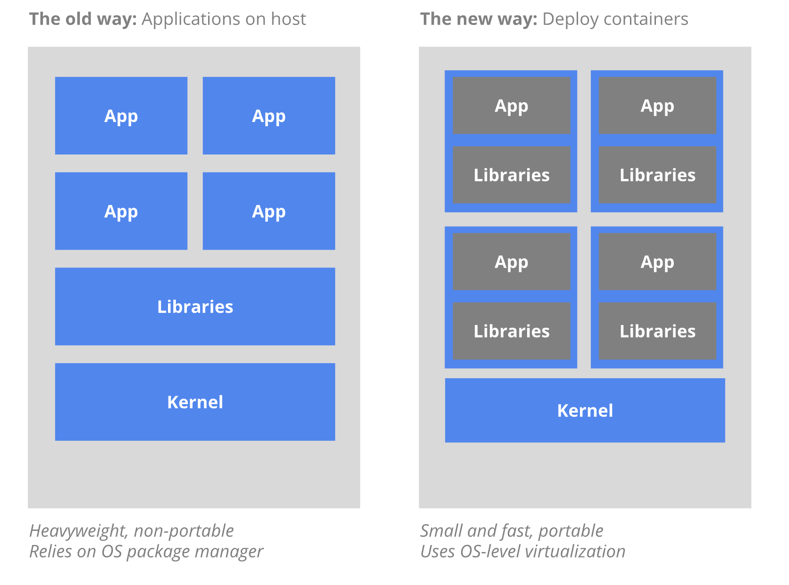
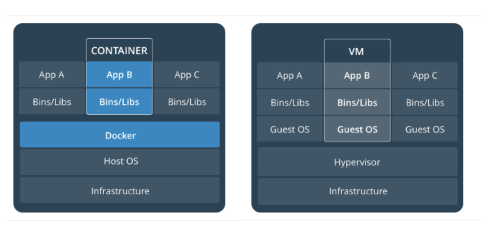
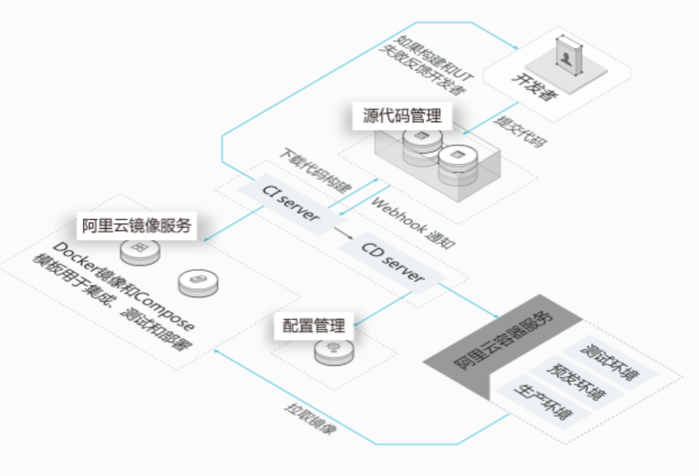

# Docker 入门指引（一） 起源

> #技术文档/Docker 容器 修改于 2019 年 4 月 24 日 下午 7:23

2019 年 4 月 24 日 下午 7:23

> 本文部分内容引用或改编自： [http://www.ruanyifeng.com/blog/2018/02/docker-tutorial.html](http://www.ruanyifeng.com/blog/2018/02/docker-tutorial.html) [ 阮一峰老师博客 ] ，如需要了解更详细他的思想，建议移步阮老师的文章，然后继续回看本文。  
>

## 为什么诞生和流行?

> 任何一项「技术」或「 新兴事物」的诞生，究其根本都是为了解决问题。

软件开发过程中的问题：程序员很讨厌用别人的 PC 工作，也十分厌恶去搭建一个开发、生产环境，因为他根本不知道这是第几次做这样**愚蠢**的操作了，实际上相信大多程序员都能有同样的感知。

更何况是部署服务的工程师，每天都在创造新建一个“环境”（可能是虚拟机环境也可能是直接的生产环境服务器系统上），然后在这个环境上，安装各种如 nginx，redis，mysql 等软件，为它们配置属性，打开端口，开启防火墙等操作。需要提高工作效率，带环境安装是亟需解决的问题。聪明(**有经验**)的程序员总在干一件聪明的事，就是让事情尽可能只写一遍代码，而不是重复劳动，拧同样的螺丝。「 也就是 DRY 1 (`Don’t Repeat Yourself`) 原则 」

**虚拟机（virtual machine）就是带环境安装的一种解决方案**。它可以在一种操作系统里面运行另一种操作系统，比如在 Windows 系统里面运行 Linux 系统。应用程序对此毫无感知，因为虚拟机看上去跟真实系统一模一样，而对于底层系统来说，虚拟机就是一个普通文件，不需要了就删掉，对其他部分毫无影响。在 Docker 诞生前，虚拟机是曾经被大篇幅用来做目前 docker 的事务的载体，那个年代微服务2架构还不那么流行或者是还没有这样的概念。虽然用户可以通过虚拟机还原软件的原始环境。但是，这个方案有几个缺点：

**（1）资源占用多**
虚拟机会独占一部分内存和硬盘空间。它运行的时候，其他程序就不能使用这些资源了。哪怕虚拟机里面的应用程序，真正使用的内存只有 1MB，虚拟机依然需要几百 MB 的内存才能运行。

**（2）冗余步骤多**
虚拟机是完整的操作系统，一些系统级别的操作步骤，往往无法跳过，比如用户登录。

**（3）启动慢**
启动操作系统需要多久，启动虚拟机就需要多久。可能要等几分钟，应用程序才能真正运行。

虚拟机存在以上的缺点，Linux 逐件发展出了另一种虚拟化技术：Linux 容器（Linux Containers，缩写为 LXC）

### Linux 容器（ Docker 容器）不是模拟一个完整的操作系统，而是对进程进行隔离。 {docsify-ignore}

或者说，在正常进程的外面套了一个 [保护层](https://opensource.com/article/18/1/history-low-level-container-runtimes) 。对于容器里面的进程来说，它接触到的各种资源都是虚拟的，从而实现与底层系统的隔离。
由于容器是进程级别的，相比虚拟机有很多优势。

**（1）启动快**
容器里面的应用，直接就是底层系统的一个进程，而不是虚拟机内部的进程。所以，启动容器相当于启动本机的一个进程，而不是启动一个操作系统，速度就快很多。

**（2）资源占用少**
容器只占用需要的资源，不占用那些没有用到的资源；虚拟机由于是完整的操作系统，不可避免要占用所有资源。另外，多个容器可以共享资源，虚拟机都是独享资源。

**（3）体积小**
容器只要包含用到的组件即可，而虚拟机是整个操作系统的打包，所以容器文件比虚拟机文件要小很多。
总之，容器有点像轻量级的虚拟机，能够提供虚拟化的环境，但是成本开销小得多。

> Docker 容器的思想来自于集装箱，集装箱解决了什么问题？在一艘大船上，可以把货物规整的摆放起来。并且各种各样的货物被集装箱标准化了，集装箱和集装箱之间不会互相影响。那么我就不需要专门运送水果的船和专门运送化学品的船了。只要这些货物在集装箱里封装的好好的，那我就可以用一艘大船把他们都运走。[docker 容器的起源](https://blog.csdn.net/qq_36172443/article/details/81111934)

优胜劣汰，物竞天择。大量的云部署和微服务架构逐渐向容器化方向发展，同时因为容器的存在和可编程生产和销毁的方式，衍生出了编排和调度系统，用以实现跨主机集群的自动部署、扩展以及运行应用程序容器。例如 Kubernetes [https://zh.wikipedia.org/wiki/Kubernetes](https://zh.wikipedia.org/wiki/Kubernetes) 、SWARM 等。可以参考 [巅峰对决之 Swarm、Kubernetes、Mesos - DockOne.io](http://dockone.io/article/1138) 了解更多。

## Docker 的应用场景

- Web 应用的自动化打包和发布。
- 自动化测试和持续集成、发布。
- 在服务型环境中部署和调整数据库或其他的后台应用。

## 部署方式 {docsify-ignore}

> 就像上面所描述的一样，从整体看除去部署上面的便利性以外，差别主要在于资源开销和效能「本质上，效能高低也是资源利用率的表现」。从内部而言，就是虚拟机引入了大量内部不需要引入的文件或功能「我要这个扫雷软件干嘛！😂」

 

## 历史和知识拓展 {docsify-ignore}

1. DRY 原则(Don’t Repeat Yourself，与 Once and only once 简称 OAOO 相似)特指在程序设计以及计算中避免重复代码，因为这样会降低灵活性、简洁性，并且可能导致代码之间的矛盾，DRY 是 Andy Hunt 和 Dave Thomas’s 的《 The Pragmatic Programmer 》书中的核心原则。
2. 微服务自 [2014 年 3 月](http://martinfowler.com/articles/microservices.html) 由 Martin Fowler 首次提出，在 [Spring Cloud](http://projects.spring.io/spring-cloud/) 、 [Dubbo](http://dubbo.apache.org/) 等各类微服务框架的帮助下，以燎原之势席卷了整个 IT 技术界，成为了最主流的分布式应用解决方案。
3. 阿里云的 CI/CD 结构图如下：
   
