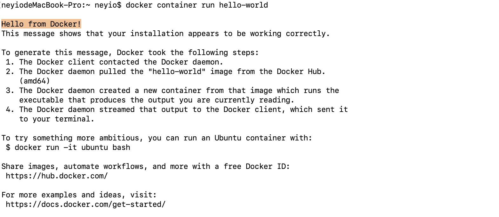

# Docker 入门指引（二） 使用
> #技术文档/Docker容器  修改于 2019年4月24日 下午7:53   

感谢 [Docker 入门教程 - 阮一峰的网络日志](http://www.ruanyifeng.com/blog/2018/02/docker-tutorial.html)  阮老师的文章，感觉写的很精干，本文借鉴了部分文章思想和探究方式。

!> 前方预警：Docker知识有些许不方便调试（尤其是国内）或者不像学习语言语法一样能直接上手，但是不要放弃，坚持下去。

## 常见概念
Docker镜像(image)与容器(container)：简单的说镜像就是某个事物的原样拷贝，「好比跟你在镜子里看到的你自己」。它是一份用于创建 Docker 容器的模板，但是往往指的是尚未被实例化前的状态，一旦被创建，我们一般可以称之为某镜像的运行实例。本文中的容器则是通过Docker镜像所创建的运行实例，是独立运行的一个或一组应用。容器与镜像的关系可以简单理解为**类似于面向对象编程中的对象与类**那样。
Docker镜像仓库用来保存镜像，可以理解为代码控制中的代码仓库。Docker Hub( [https://hub.docker.com](https://hub.docker.com/) ) 提供了庞大的镜像集合供使用。
Docker客户端用于使用远程API来管理和创建Docker容器。

> Image 是二进制文件。实际开发中，一个 image 文件往往通过继承另一个 image 文件，加上一些个性化设置而生成。举例来说，你可以在 Ubuntu 的 image 基础上，往里面加入 Apache 服务器，形成你的 image。  

## Docker使用
!> 在开始下文前有必要明确概念，一般我们聊天中说我用docker部署了一套某系统，这句话Docker指的是Docker这个程序，某系统指的是包含docker运行实例的集合体（包含但不限于）。

### 示例
我们要实现一套最基础可以运行的系统，首先需要创建或者载入一个镜像,然后实例化。
我们通过以下步骤实现：

1. 拉取一个hello-world镜像。`docker image pull library/hello-world:latest`  。
>  `library/hello-world` 中的 `library`指的是 命名空间，若不填写，则默认为library（它是一个docker官方空间）。`latest`可以理解为标签（类似版本识别号）。  
运行结果如下：


2. 实例化镜像 `docker container run hello-world`
运行结果：



> docker container run命令会从 image 文件，生成一个正在运行的容器实例。注意，docker container run命令具有自动抓取 image 文件的功能。如果发现本地没有指定的 image 文件，就会从仓库自动抓取。因此，前面的docker image pull命令并不是必需的步骤。  

示例如下：


3. 杀死容器，上述`hello-world`镜像容器一旦执行完毕，自行了断了。但是有些容器例如 Mysql,Redis等并不会自动终结，确切说用户也不希望他自动终结。但是这些服务如果需要终结，那么在客户端执行：

```bash
docker container kill [CONTAINER ID] 
# CONTAINER ID 可以通过  docker container ls 或 docker ps 获取 ，指的是容器唯一标识符，显示内容为正在运行的容器列表。
# docker container ls --all 或  docker ps -a 用于获取历史及正在运行的容器，含已停止的容器。
```

模拟方法：

```bash
# 在一个Terminal中运行以下代码
docker container run redis:3.2
# 新开启一个Terminal
docker container ls # 获取到类似 CONTAINER ID  ： 48919850d05f 的数据，执行
docker container kill 48919850d05f 
# 程序在第一个终端中随即退出
```

!>  终止运行的容器文件，依然会占据硬盘空间，可以使用`docker container rm [CONTAINER ID]`命令删除。运行上面的命令之后，再使用`docker container ls —all` 命令，就会发现被删除的容器文件已经消失了。 

如何删除容器

```bash
docker container rm $(docker container ls -a -q ) # 删除所用容器
docker rm $(docker ps -a -q)  #效果同上
```


## Dockerfile文件
Dockerfile顾名思义用以描述docker容器的文件（即镜像image的配置文件）。我们可以通过生成自己的Dockerfile自定义镜像，Docker 根据 该文件生成对应的二进制image 文件。

我们一起探究如何通过Dockerfile 部署一个Egg.js容器。
本文源代码已经上传至 [GitHub - neyio/docker-helloegg-demo: docker-helloegg-demo.](https://github.com/neyio/docker-helloegg-demo) 

### 1. 编写Dockerfile 
“无头无脑”的开始编写一个文件肯定是一个痛苦的事情，一般来说我们可以这么去理解拆解这件事情。
我们需要用这个文件构建一个镜像的配置文件，我们常规的可以理解为我们需要把一份可以执行的代码组合放到里面。

?> 包括以下3个内容： 1. 程序员自己的源代码 2.源代码执行所依赖的环境 3.如何在搭建完成后让这份源代码在环境中跑起来。

上述上个内容对应了三件事，第一件事情是先搭一个环境，然后再把源代码放到指定的位置上，然后再通过配置好的执行命令让代码在指定位置跑起来。

* 使用`FROM`命令继承一个官方环境。

!> 假设我们使用的都是现成的环境，比如 Node 。 `FROM node:latest`  该 image 文件继承官方的 node image，冒号表示标签。

* 复制用户源代码进目录。

执行`COPY`命令，`COPY . /app # 拷贝当前目录下的所有未被dockerignore文件排除的文件至 镜像的/app文件夹中`

* 配置环境或直接执行命令（本Egg.js例子容器需要依赖npm引入的node_modules文件夹内的各种依赖故需要进行“程序的运行环境配置”<sup>1</sup>）

执行切换工作目录命令 `WORKDIR`,`WORKDIR /app #切换至镜像的/app文件夹，该文件夹中此时已包含本项目package.json`
使用`RUN`命令进行运行前环境配置（`RUN`可以有多条），`RUN npm install —registry=https://registry.npm.taobao.org # —registry 指定了源的位置（淘宝镜像），以提速npm install 速度`
执行`CMD`命令进行运行命令，`CMD npm run start # 启动egg product环境`

!> 但是实际上 Docker容器的端口是未直接暴露给宿主机器端口的，试想下如果多套系统都运行在一个环境里，例如Redis的3369端口会被多个环境所占用，岂不是很繁琐，而且成百上千个微服务容器如果在一台宿主机上给每个端口做划分本身是一件难以想象的任务。

所以在执行`CMD`命令前，我们需要只需要把对应的服务端口暴露即可.`EXPOSE 7001 # egg默认使用了7001端口`

完整的dockerfile如下：
```dockerfile
FROM node:latest
COPY . /app
WORKDIR /app
RUN npm install --registry=https://registry.npm.taobao.org
EXPOSE 7001
CMD [ "npm run start" ]
```

### 2.构建镜像

有了 Dockerfile 文件以后，就可以使用`docker image build`命令创建镜像文件了。
```bash
docker image build -t egg-demo . # 结尾的 `.` 表示当前目录路径
# 或 指定一个tag（可以理解为版本号）的形式
docker image build -t egg-demo:0.0.1 .
```
上面代码中，`-t`参数用来指定 image 文件的名字，用冒号指定`tag`标签。如果不指定，默认的`tag`就是`latest`。最后的那个点表示 Dockerfile 文件所在的路径，上例是当前路径，所以是一个点。

通过`docker image ls`查看镜像是否在镜像列表中。

> 注意，指定了CMD命令以后，`docker container run`命令就不能附加命令了（比如前面的`/bin/bash`），否则它会覆盖`CMD`命令。  

### 3.启动容器
现在，启动容器可以使用下面的命令。`docker container run —rm -d -p 3001:7001 -it egg-demo:0.0.1 ` ，其中 `-rm` 指的是容器退出后自动销毁。`-d`表示后台静默执行。`-p`则是表示 将传入的参数 `3001:7001`做一个端口映射， `-it` 是将容器的 `shell`映射到当前的 `shell`，然后你在本机窗口输入的命令，就会传入容器内。

!> 为什么每次执行镜像就会直接退出？？？
可以理解如下：
?> docker的周期依赖前台有一个持续执行的进程，如果执行 `docker run` 或者 `dockerfile`中的`CMD`命令后，`CMD`返回了`exit`,随即`docker`容器也被杀死。

示例中 使用了 `CMD /bin/bash deploy.sh`的形式以保持进程不被杀死。`deploy.sh`如下所示：

```shell
#!/bin/bash
npm run start
while true ;
do sleep 10;
done
```

此时，我们在浏览器中输入`localhost:3001`就可以看到`egg`输出的`hi,egg`，基本和在本地直接启动项目性能接近。

?> 为了确认是否在容器内部杀死该 `deploy.sh`的`shell`命令进程，就能使得容器自身被`kill`。
```bash
docker exec -it [container ID] /bin/bash 		# 进入某容器内
ps aux # 找到 deploy.sh ，一般PID为 6
kill 6 # 随即shell被终止了,容器被销毁
```

### 4.发布镜像
```bash
#发布镜像代码 docker image tag [imageName] [username]/[repository]:[tag]
docker image tag egg-demo:latest neyio/egg-demo # 如果 你之前在build阶段加了用户前缀(docker image build -t [username]/[repository]:[tag] . )则此时无需进行该操作。 
```

下一章节，我们尝试把多个项目多个镜像整合在一起提供一套比较完整的服务。

- - - -

## 常用命令
> 可参考 [Docker 容器使用 ](http://www.runoob.com/docker/docker-container-usage.html) 例子。  
举例如下：
`docker`命令可以显示docker的命令。
使用命令 `--help` 用以检视可选项和提示。
```
docker COMMAND --help
docker container ls --help
docker container rm --help
docker ps --help
docker rm --help
```

### Docker操作命令

```bash
docker build -t image-name . # 使用此目录的 Dockerfile 创建镜像 ， 形成的镜像可以在 使用 docker images 找到
docker run -p 4000:80 image-name  # 运行镜像 ，将容器内的端口80“镜像名称”映射到宿主4000端口 ，使用CMD+C直接能退出
docker run -d -p 4000:80 image-name  # 运行镜像内容相同 ，但是程序在后台运行
docker ps  # 查看所有正在运行的容器的列表
docker stop <hash> # 平稳地停止指定的容器
docker ps -a # 查看所有容器的列表，甚至包含未运行的容器
docker kill <hash>  # 强制关闭指定的容器
docker rm <hash>  # 从此机器中删除指定的容器
docker rm $(docker ps -a -q)  # 从此机器中删除所有容器
docker images -a  # 显示此机器上的所有镜像
docker rmi <imagename> # 从此机器中删除指定的镜像
docker rmi $(docker images -q)  # 从此机器中删除所有镜像
docker login  # 使用您的 Docker 凭证登录此 CLI 会话
docker tag <image> username/repository:tag 	 # 标记 <image> 以上传到镜像库
#例如 docker tag friendlyhello neyio/get-started:part1
docker push username/repository:tag # 将已标记的镜像上传到镜像库
docker run username/repository:tag  # 运行镜像库中的镜像
```


## 如何练习&构建练习环境

!> 建议上阿里云，购买抢占式实例，一般2核4G就够用，每小时约0.08元非常划算，博主选择了Centos。

Centos安装：

```bash
yum install -y docker # 直接跑会遇到 Cannot connect to the Docker daemon at unix:///var/run/docker.sock. Is the docker daemon running?错误

# 操作如下即可
sudo systemctl enable docker
sudo systemctl start docker

# Demo
docker image pull hello-world
docker run hello-world

# 开始爽吧...
```


## 附录
1. 如本文项目本身是简单一个js文件,例子如下，则本阶段无需进行 `RUN`命令的相关配置。
```javascript
function sayHello(){
	console.log('hello');
	return true;
}
sayHello();
```
2. 本文容易遗漏的点罗列：
* 终止运行的容器文件，依然会占据硬盘空间，可以使用`docker container rm [CONTAINER ID]`命令删除。
* 在`docker container run xxx /bin/bash`时`dockerfile`指定的CMD命令会被覆盖。

?> docker的周期依赖前台有一个持续执行的进程，如果执行 `docker run` 或者 `dockerfile`中的`CMD`命令后，`CMD`返回了`exit`,随即`docker`容器也被杀死。可以通过`CMD`执行一个死循环的`.sh`文件来保持进程。

