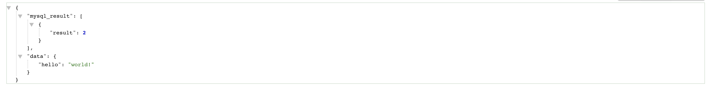

# Docker 入门指引（三） 使用
> #技术文档/Docker容器  修改于 2019年4月25日 下午2:51   

继续借鉴[Docker 微服务教程 - 阮一峰的网络日志](http://www.ruanyifeng.com/blog/2018/02/docker-wordpress-tutorial.html) 阮老师的文章 ，本文借鉴了部分文章思想和探究方式。
微服务的相关信息可以参见 [开源架构技术漫谈：基于Kafka构建事件溯源模式的微服务 | Ribose Yim’s Tech Blog](https://riboseyim.com/2017/06/12/OpenSource-Kafka-Microservice/)
以及 [微服务核心架构梳理 - 掘金](https://juejin.im/post/5c0ba2bef265da614d08fefe) 

## 开发过程中的问题
!> 我们希望一套健壮、高效的系统是高内聚，松耦合，可渐进式开发的。各个开发人员能专注自己的某块进行深度开发，提高开发效率，优化程序性能。不能像因为传统软件开发项目一样，某个团队进行某个项目的开发，其中的逻辑关系都是仅能用于某一套系统中的，甚至都不能被其他开发人员或部门二次利用，就跟一次性筷子一样，等到开发团队接到其他开发任务后，又需要重新造轮子或者复制粘贴多个版本的代码。不同模块的开发揉在一起，使得测试都是需要十八般武艺，甚至需要了解不同模块的不同技术栈。


在上一篇文中，我们使用了容器进行构建一个`egg.js`应用，如果亲爱的你跑完了上面的代码，你会发现，构建是及其友好的，并且**轻巧，快捷，易封装发布**。而正是这些便利性以及软件工程中的问题，促使我们去尝试用容器解决这一**偏架构**的问题。我们可以尝试 **像运输集装箱一样**，把不同的集装箱放在一架货轮上扬帆起航，充分利用它的载货能力，当一个集装箱不够用的时候，再开一个；当一个货轮不够用的时候，再起一个，这跟微服务架构异曲同工，使用容器的时候了解微服务架构相得益彰。


## 我们接下来通过构建一个相对完整的Egg.js（含Redis 和 Mysql）来进一步学习如何链接各个微服务{docsify-ignore}

!> 那么废话少说，开门见山。Show me the code. 本文力求短小精干，以给阅读者信心😊

### 构建实例
?> 本段落以了解流程为主，后续docker已经不推荐 —link 方式进行构建。
1. 根据上一篇文章创建一个类似 [https://github.com/neyio/docker-fullegg-demo](https://github.com/neyio/docker-fullegg-demo) 的项目结构，用于启动`egg.js`服务。(此处略微不同的是使用了 `docker run -v`<sup>1</sup>) 。启动`docker run -p 7001:7001 -it -d -v $PWD/volume:/app/volume  egg-full-demo`服务。
2. 创建一个mysql服务并传入账户密码和数据名称。  
?>  延伸阅读[MySQL 到底能不能放到 Docker 里跑？ - 阅读 - 掘金](https://juejin.im/entry/5a03c2f25188253d681706f4)
下载镜像`docker image pull mysql:5.7`,使用MYSQL镜像创建容器`docker run -e  MYSQL_ROOT_PASSWORD=root --env MYSQL_DATABASE=neo -p 3306:33060  -it --name=egg-mysql-server  mysql:5.7 ` 
`-e`用于指定MYSQL容器所需的环境变量  `MYSQL_ROOT_PASSWORD`表示`root`的密码，`MYSQL_DATABASE`新建名为`neo`的db。
使用下方代码尝试登陆下：
```bash
mysql -uroot -P 33060 -h 127.0.0.1 -p
```
Mysql服务启动完成。
!> 更加详细的例子参看 附录<sup>2</sup>
3. 下载镜像`docker image pull redis:3.2`.在full-egg-demo目录下跑以下代码，`$PWD`指代该目录。目录下存放了`redis.conf`，默认密码为`neo`
```bash
#示例1
docker run --rm -d -e PASSWORD="neo" --name egg-redis-server -p 6379:63790 -v $PWD/redis:/data redis:3.2 --requirepass "neo"
#示例2 使用 docker run -d --rm -it -p 6379:36379  -v $PWD/redis.conf:/etc/redis/redis.conf -v $PWD/redis:/data -d redis:3.2 redis-server /etc/redis/redis.conf   —appendonly yes
```
上述示例中`-v` 挂载了 `redis`文件夹目录作为 `redis`的`data`目录，以方便写入持久化,设置了`PASSWORD`变量，以方便`link`时访问。本文用示例1启动成功后，执行`docker exec -it <hash> /bin/bash`，进入`shell`后可通过`redis-cli -a neo ` 登陆redis， 输入info查看信息，若有输出则表示配置完成。

4. 把上述三者的配置结合起来，使其相互能够访问。
?> 即将被废弃：关于link的理解 ：[关于对docker run —link的理解 - 简书](https://www.jianshu.com/p/21d66ca6115e) 阮老师在文章中用 “跟上一次相比，上面的命令多了一个参数 —link wordpressdb:mysql，表示 WordPress 容器要连到wordpressdb容器，冒号表示该容器的别名是mysql。”一笔带过了。
其实可以这么理解，将两者的 放在同一个组内，该组内的服务的环境变量相通，并使得内网端口可以访问，也就是`mysql-server`的`3306`端口可以直接访问了，为了证明这一点，我们在`egg-js`中引入`mysql`,并在
```bash
--link egg-mysql-server:egg-mysql-server  # 此处 第一个为一个正在运行的docker服务的name属性，可以通过docker ps 看到，第二个 alias是别名，在当前启动的容器内部，可以通过env查看到的 别名_+后缀的环境变量（被link的服务的全部环境变量）
```

进入容器内部输入`env`查看当前环境的变量。如下图所示：
```bash
EGG_REDIS_SERVER_ENV_REDIS_VERSION=3.2.12
YARN_VERSION=1.15.2
EGG_REDIS_SERVER_PORT_6379_TCP_PROTO=tcp
EGG_REDIS_SERVER_ENV_GOSU_VERSION=1.10
HOSTNAME=0e27f7503be5
EGG_REDIS_SERVER_PORT=tcp://172.17.0.3:6379
EGG_MYSQL_SERVER_ENV_MYSQL_MAJOR=5.7
EGG_REDIS_SERVER_ENV_PASSWORD=neo
EGG_REDIS_SERVER_PORT_6379_TCP_ADDR=172.17.0.3
EGG_REDIS_SERVER_PORT_63790_TCP_PORT=63790
EGG_MYSQL_SERVER_ENV_MYSQL_DATABASE=neo
EGG_MYSQL_SERVER_PORT_3306_TCP=tcp://172.17.0.2:3306
EGG_MYSQL_SERVER_PORT_3306_TCP_ADDR=172.17.0.2
EGG_REDIS_SERVER_PORT_63790_TCP_PROTO=tcp
EGG_REDIS_SERVER_PORT_6379_TCP=tcp://172.17.0.3:6379
EGG_REDIS_SERVER_PORT_63790_TCP=tcp://172.17.0.3:63790
PWD=/app
HOME=/root
EGG_MYSQL_SERVER_PORT_33060_TCP_PORT=33060
NODE_VERSION=11.14.0
...
```

如何使用环境变量,参见下方附录<sup>3</sup>。

!>  实际上，这也太坑了一点，在你不知道`mysql`容器中的ENV默认的变量的时候，你必须要进去容器瞅一眼,在容器内部中跑下`env`,然后 再根据 我们的命名如 `egg-mysql-server`推断成`EGG_MYSQL_SERVER`至于 `PORT_3306_TCP_ADDR`你一般是记不住的，所以老老实实进去里面找到变量，再逆向出来去`egg`的配置文件中写进去，如果每次命名`alias`不一样，那就GG。

尝试修改 `egg-full-demo`中的`config/config.default.js`,添加如下代码
```javascript
module.exports = appInfo => {
 const config = exports = {};
 const userConfig = {
	  ... //其他代码
    mysql: {
      client: {
		   //开发环境中若不存在变量可以使用默认值,避免重复配置
        host: process.env.EGG_MYSQL_SERVER_PORT_3306_TCP_ADDR || '127.0.0.1',
        port: process.env.EGG_MYSQL_SERVER_PORT_3306_TCP_PORT || '3306',
        user: 'root',
        password: process.env.EGG_MYSQL_SERVER_ENV_MYSQL_ROOT_PASSWORD || 'root',
        database: process.env.EGG_MYSQL_SERVER_ENV_MYSQL_DATABASE || 'neo',
      },
      app: true,//挂载到 全局的application对象上，使得控制器或服务中能直接通过this.app.mysql访问单例
      agent: false,
    },
  };
#console.log(process.env.EGG_MYSQL_SERVER_PORT_3306_TCP_ADDR,process.env.EGG_MYSQL_SERVER_PORT_3306_TCP_PORT) 此处在真实运行时，初始化egg时会输出 类似 172.17.0.2 3306 的结果 以验证我们猜测的内网互通，相当于mysql对egg容器开了绿色通道。
return {...config,...userConfig};
};
```
修改 `app/controller/home.js`的 `index`方法
```javascript
  async index() {
    const {
      ctx,
      app,
    } = this;
    const data = require('../../volume/data.json'); # 本处用以验证 -v挂载成功
    const mysql_result = await app.mysql.query('SELECT 1+1 AS result'); # 本处用以验证 mysql 访问成功
    ctx.body = { mysql_result, data };
  }

```

访问 `http://127.0.0.1:7001` 应该可以看到输出结果如下：


至此Mysql互通完成,接下来简述Redis的相关操作.
先关闭`egg-full-demo`容器(`docker kill <hash>`)。在`egg-full-demo`项目中引入`egg-redis`,修改`plugins`文件，增加
```javascript
module.exports = {
...
redis: {
    enable: true,
    package: ‘egg-redis’,
  },
}
```
!>实际上，修改config.default.js被我吃了，这也太坑了一点，再进env查看变量，在刚才mysql配置后面勉强加上。
```javascript
...
mysql:{...},
    redis: {
      client: {
        port: process.env.EGG_REDIS_SERVER_PORT_6379_TCP_PORT || 6379, // Redis port
        host: process.env.EGG_REDIS_SERVER_PORT_6379_TCP_ADDR || '127.0.0.1', // Redis host
        password: process.env.EGG_REDIS_SERVER_ENV_PASSWORD || null,
        db: 0,
      },
    },
```
?> 这种配置方式真的很恶魔👿，这也是为什么后面我们需要compose的原因。
在`app/controller/home.js`增加试验代码
```javascript
async index(){
...
    const mysql_result = await app.mysql.query('SELECT 1+1 AS result');
    const redis_result = await app.redis.get('helloworld') || 1;
    app.redis.set('helloworld', parseInt(redis_result) + 1, 'EX', 100);
}
```

执行docker命令 `docker run -p 7001:7001 -it -d -v $PWD/volume:/app/volume  --link egg-redis-server:egg-redis-server --link egg-mysql-server:egg-mysql-server  egg-full-demo`
访问`http://127.0.0.1:7001/`看到输出：
```json
{
    "mysql_result": [
        {
            "result": 2
        }
    ],
    "redis_result": "1",
    "local_result": {
        "hello": "world!"
    }
}
```

至此，EGG+MYSQL+REDIS 项目搭建完毕，内心一万点暴击。一直在切换容器，调整数据，修改配置。


### 使用Docker-compose构建服务

!> 所以程序员发明了一个名为`docker-compose`，就是用来解决上述复杂的配置问题的。

上述配置可以修改为下方的配置表，干净整洁，我们只需要输入命令 `docker-compose up`即可搭建刚才的环境。
> 常规使用可以参考 [Docker之Compose服务编排 - 飞鸿影~ - 博客园](https://www.cnblogs.com/52fhy/p/5991344.html)  
 
```yaml
egg-full-demo:
  image: egg-full-demo
  links:
    - mysql:egg-mysql-server
    - redis:egg-redis-server
  ports:
    - "7001:7001"
  volumes:
    - ./volume:/app/volume
mysql:
  image: mysql:5.7
  container_name: egg-mysql-server
  environment:
    - MYSQL_ROOT_PASSWORD=root
    - MYSQL_DATABASE=neo
redis:
  image: redis:3.2
  container_name: egg-redis-server
  environment:
    - PASSWORD=neo
  volumes:
    - ./redis:/data
```

### 安装Docker-compose
> 参见地址 [Install Docker Compose | Docker Documentation](https://docs.docker.com/compose/install/#install-compose)   

1. 下载文件
```bash
sudo curl -L “https://github.com/docker/compose/releases/download/1.24.0/docker-compose-$(uname -s)-$(uname -m)” -o /usr/local/bin/docker-compose
```
2. `sudo chmod +x /usr/local/bin/docker-compose` 给予权限
3. `sudo ln -s /usr/local/bin/docker-compose /usr/bin/docker-compose` 置入`bin`中方便直接调用,`-s`是软链接的意思。
4. `docker-compose —version`查看版本号


## 附录
1. 挂载 `-v $PWD/path:/inner-docker-path/ `，以下实例用于 将本地的目录的`volume`目录挂载到容器内部的`/app/volume`目录，挂载命令,上文未提及，故在此补充。
```bash
	docker run -d -p 7001:3001 -v $PWD/volume:/app/volume  egg-full-demo 
```
如果我们在`.dockerigonre`文件中使用了以下代码，再运行上述代码（前提条件是`dockerfile`中 `WORKDIR /app`等同于上述挂载目录）
```dockerignore
...
volume
...
```
相当于将当前的`volume`又加入了其中，用于需要修改操作权限以支持容器内部对该文件的访问 `chmod -R 777 $PWD/volume`.

2. `mysql`启动可以参考下方例子，例子来自于 [https://my.oschina.net/ht896632/blog/909276](https://my.oschina.net/ht896632/blog/909276) 

```bash
docker run --name mysql-server -e MYSQL_ROOT_PASSWORD=888888 -d docker.io/mysql:5.7 --character-set-server=utf8mb4 --collation-server=utf8mb4_unicode_ci

# —name:指定容器的别名
# -e MYSQL_ROOT_PASSWORD:设置mysql数据库的密码
# -d:以守护方式启动
# docker.io/mysql:5.7：mysql镜像
# —character-set-server：设置数据库默认的编码
# —collation-server：设置排序的编码
```

3. 在`node`环境中使用`env`变量，还记得`process.env`吗=。=
4. [Docker多容器连接实例（link方式 Nginx+3*Node+Redis） - 简书](https://www.jianshu.com/p/350209916179) 可以看一看。
5. 并不建议在docker容器内部中调试代码，如果只是细微问题，需要重新构建镜像又觉得繁琐，此时又不失为提高效率的办法。
```bash
docker cp ./app/controller/home.js <hash>:/app/app/controller/home.js
```